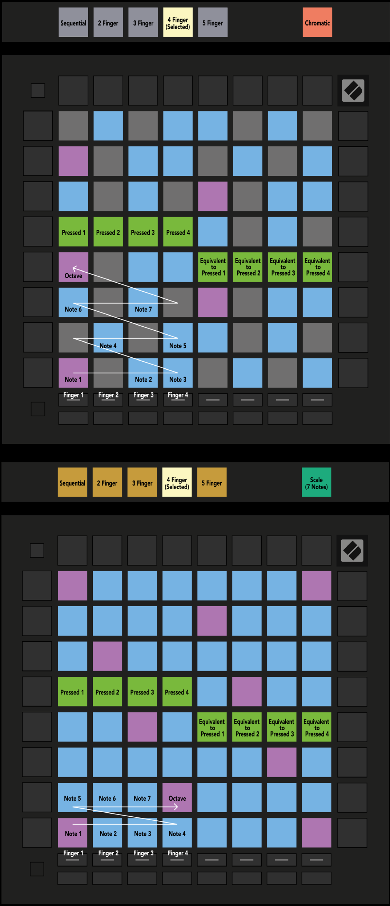

logseq-entity:: [[Logseq/Entity/Book/Section/Level 3]]
up:: [[Launchpad/Pro Mk3 User Guide/11 Appendix/02 Overlap Layouts]]
prev:: [[Launchpad/Pro Mk3 User Guide/11 Appendix/02 Overlap Layouts/01 Five Finger]]
next:: [[Launchpad/Pro Mk3 User Guide/11 Appendix/02 Overlap Layouts/03 Sequential]]
- # A.2.2 Overlap – Four Finger
	- Four-finger overlap repeats notes across rows with a shorter horizontal reach.
	- A.2.2 — Four Finger overlap in Chromatic and Scale Modes
		- 
