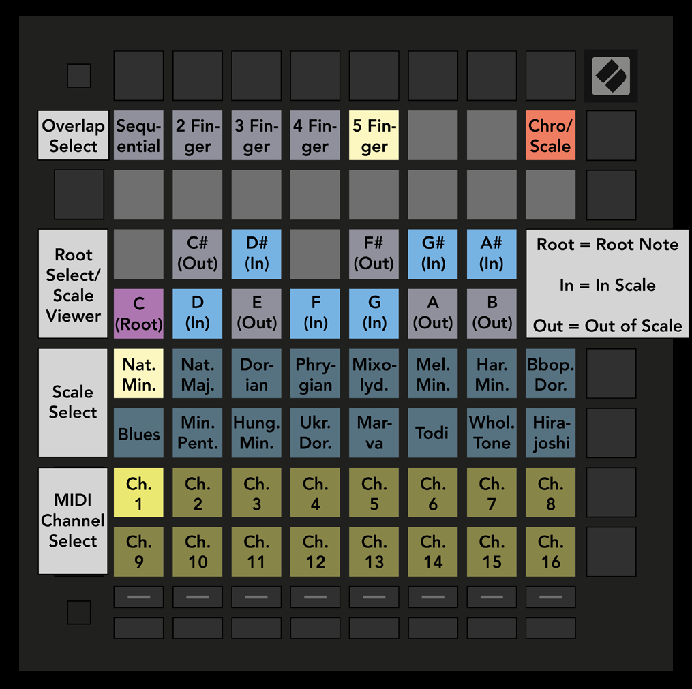

logseq-entity:: [[Logseq/Entity/Book/Section/Level 2]]
up:: [[Launchpad/UG/06 Note Mode]]
prev:: [[Launchpad/UG/06 Note Mode/03 Scale Mode]]
next:: [[Launchpad/UG/06 Note Mode/05 Overlap]]

- # 6.4 Note Mode Settings
	- Hold Shift and press Note or Chord to open settings. The Note and Chord buttons pulse green. Both modes share scale, root note, and MIDI channel.
	- 6.4.A — Note Mode settings grid
		- 
	- Press the Chromatic/Scale toggle to switch between Chromatic (dim red) and Scale (bright green). Overlap changes how successive rows share notes; see [[Launchpad/UG/06 Note Mode/05 Overlap]].
	- The Scale Viewer resembles a piano keyboard: blue notes belong to the scale, purple marks its root, and dim white notes are outside it. Press a viewer pad to choose the root.
	- Scale Select offers sixteen scales. The selected pad is bright white and other scales are dim blue: Natural Minor, Natural Major, Dorian, Phrygian, Mixolydian, Melodic Minor, Harmonic Minor, Bebop Dorian, Blues, Minor Pentatonic, Hungarian Minor, Ukrainian Dorian, Marva, Todi, Whole Tone, and Hirajoshi.
	- Choose a Note Mode MIDI channel from 1–16 to address a specific armed track.