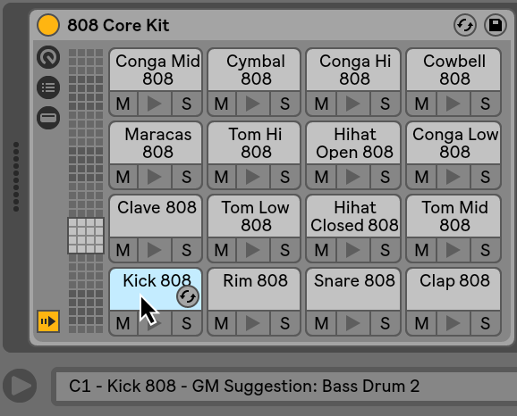
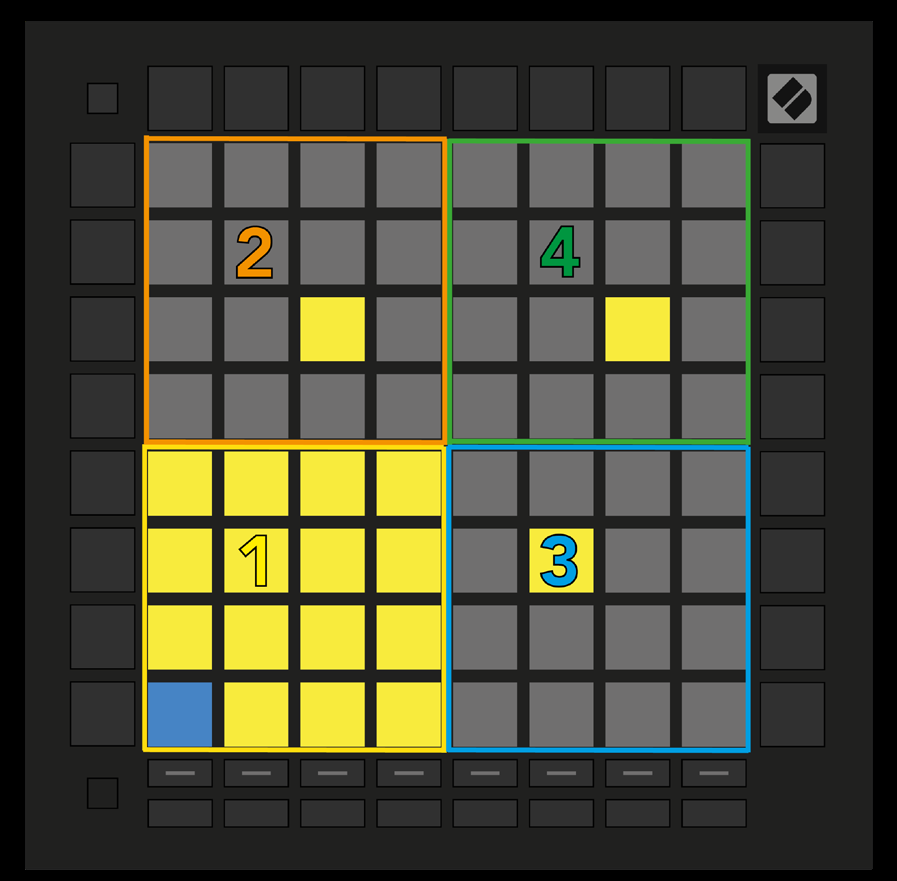

logseq-entity:: [[Logseq/Entity/Book/Section/Level 2]]
up:: [[Launchpad/UG/06 Note Mode]]
prev:: [[Launchpad/UG/06 Note Mode/05 Overlap]]

- # 6.6 Drum Mode
	- Arming a Live track containing Drum Rack switches Note Mode to a four-quadrant Drum layout. Filled Drum Rack slots light on the grid; the lower-left quadrant matches the slots currently visible in Live.
	- 6.6.A — Drum grid mapped to Live Drum Rack
		- 
		- 
	- Up/Down scrolls sixteen slots at a time; Left/Right scrolls four. A loaded sample in another quadrant glows yellow. Press a drum pad to select it in Live; the pad turns blue for editing.
	- Arming a track with another instrument restores the chosen Scale or Chromatic layout. To hear a Drum Rack, arm its track and set Live monitoring to Auto.