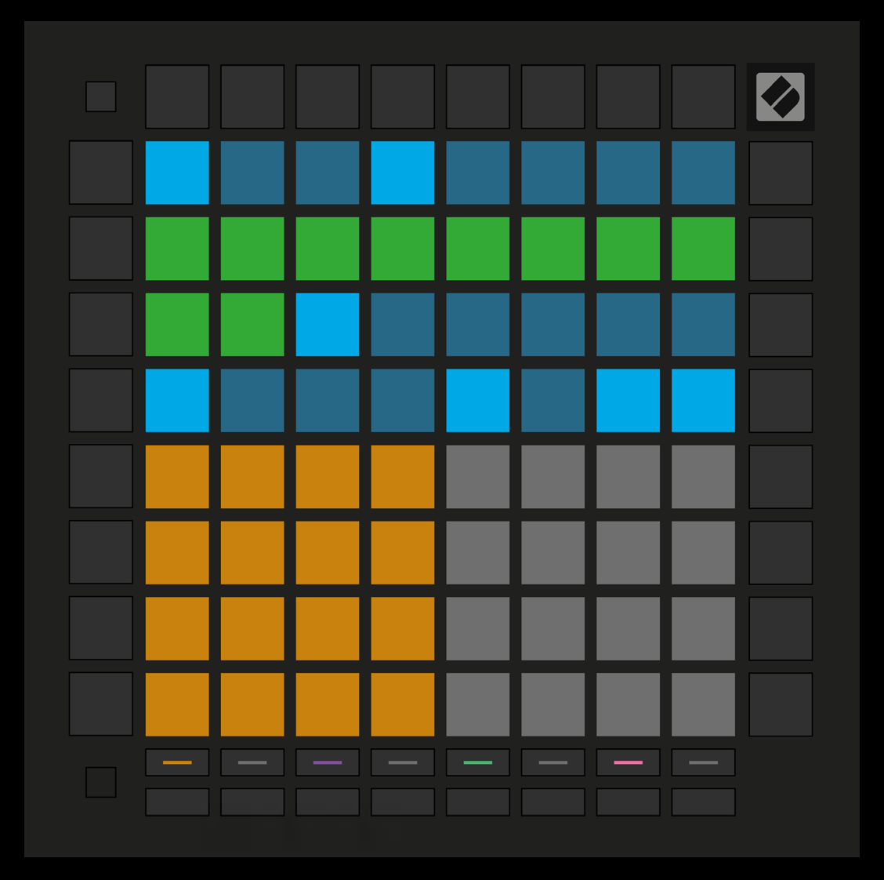

logseq-entity:: [[Logseq/Entity/Book/Section/Level 3]]
up:: [[Launchpad/UG/09 Sequencer/02 Steps View]]
prev:: [[Launchpad/UG/09 Sequencer/02 Steps View/06 Record]]
next:: [[Launchpad/UG/09 Sequencer/02 Steps View/08 Tracks]]

- # 9.2.7 Setting gate length
	- Press and briefly hold a step until it pulses green. Keep holding it and press a later step to set how many steps the notes last. The intervening steps pulse green.
	- To reset the gate to one step, press the pad that would set a two-step gate twice. The second press returns the gate to one step.
	- Ten-step gate length
		- 