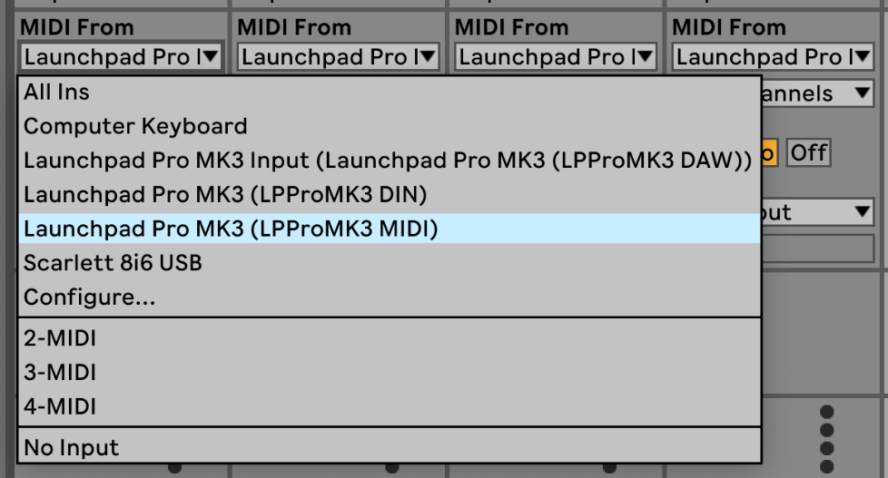
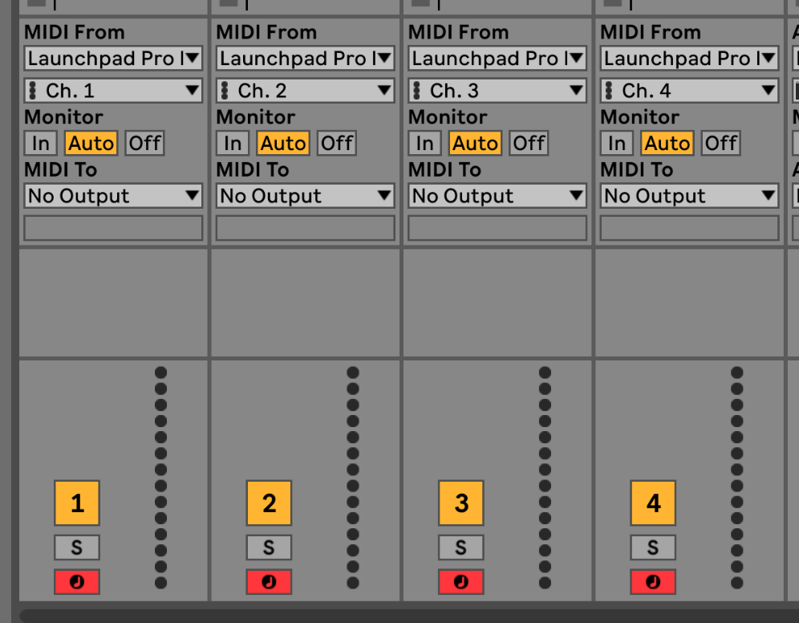
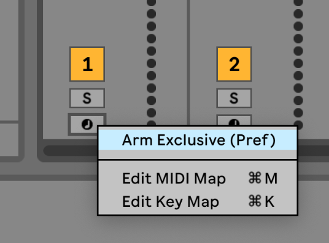

logseq-entity:: [[Logseq/Entity/Book/Section/Level 3]]
up:: [[Launchpad/UG/09 Sequencer/02 Steps View]]
prev:: [[Launchpad/UG/09 Sequencer/02 Steps View/08 Tracks]]

- # 9.2.9 Using the Sequencer with Ableton Live
	- Ableton Live MIDI tracks accept input from any channel by default. If several sequencer tracks play while multiple Live tracks are armed, the notes can reach every armed track. Assign a separate input channel to each Live track.
	- In Live, choose “Launchpad Pro MK3 (LPProMK3 MIDI)” as MIDI From on Mac, or “LPProMK3 MIDI (MIDI 1)” on Windows.
	- Ableton Live MIDI input port
		- 
	- Set each Live track to the channel of its Launchpad sequencer track. By default, Launchpad tracks 1–4 send on MIDI channels 1–4. Sequencer Settings can change those channels.
	- Ableton Live track MIDI channels
		- 
	- Set Monitor to Auto and arm the Live tracks. To arm several at once, hold Command on Mac or Control on Windows while clicking each record-arm button. You can instead disable “Arm Exclusive” from a record-arm button’s context menu.
	- Ableton Live Arm Exclusive setting
		- 