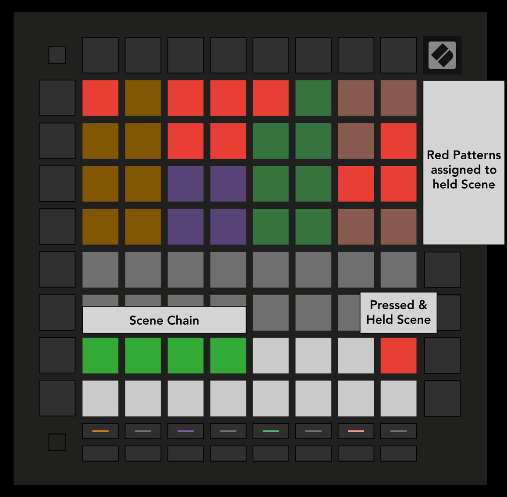

logseq-entity:: [[Logseq/Entity/Book/Section/Level 2]]
up:: [[Launchpad/UG/09 Sequencer]]
prev:: [[Launchpad/UG/09 Sequencer/03 Patterns View]]
next:: [[Launchpad/UG/09 Sequencer/05 Pattern Settings]]

- # 9.4 Scenes
	- A Scene triggers Patterns across all four tracks with one press. The 16 white pads at the bottom of Patterns View represent Scenes. Scenes can also be chained into a longer song structure.
	- Scenes in Patterns View
		- 
	- {{embed [[Launchpad/UG/09 Sequencer/04 Scenes/01 Assign]]}}
	- {{embed [[Launchpad/UG/09 Sequencer/04 Scenes/02 Chain]]}}
	- {{embed [[Launchpad/UG/09 Sequencer/04 Scenes/03 Queue]]}}
	- {{embed [[Launchpad/UG/09 Sequencer/04 Scenes/04 Clear]]}}
	- {{embed [[Launchpad/UG/09 Sequencer/04 Scenes/05 Duplicate]]}}