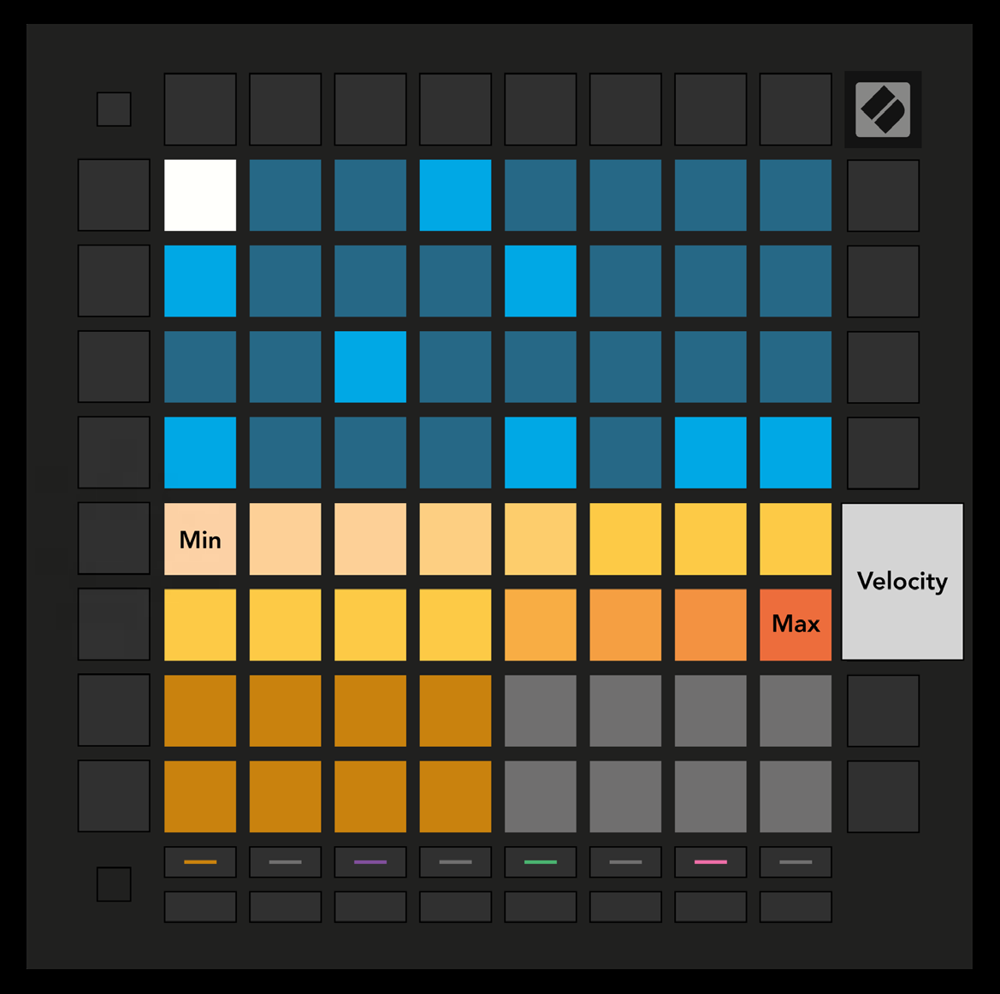

logseq-entity:: [[Logseq/Entity/Book/Section/Level 3]]
up:: [[Launchpad/UG/09 Sequencer/06 Velocity]]
next:: [[Launchpad/UG/09 Sequencer/06 Velocity/02 Live Record]]

- # 9.6.1 Step Velocity edit
	- Press Velocity to see and edit the velocity of each step. Select a step in the top half of the grid; its velocity appears on the two-row slider at the top of the Play Area.
	- Press a slider pad to set the selected step’s velocity from 1 (minimum) to 16 (maximum). Manual edits set every note on a multi-note step to the same velocity.
	- Velocity view
		- 