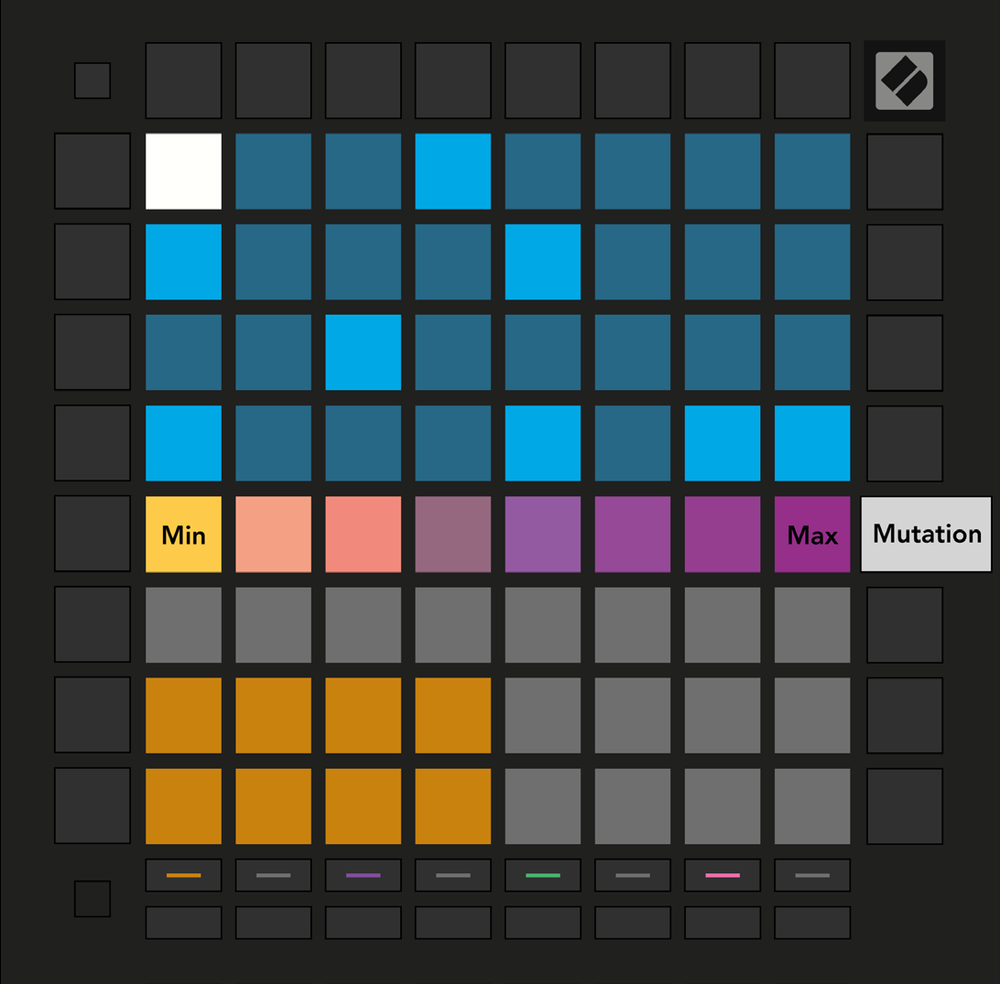

logseq-entity:: [[Logseq/Entity/Book/Section/Level 3]]
up:: [[Launchpad/UG/09 Sequencer/08 Mutation]]
next:: [[Launchpad/UG/09 Sequencer/08 Mutation/02 Print]]

- # 9.8.1 Editing Step Mutation
	- Press Mutation and select a step in the top half of the grid. The top row of the Play Area shows an eight-pad Mutation slider for that step.
	- The leftmost value means no Mutation; the rightmost is the maximum. Newly recorded or assigned steps begin with no Mutation (one pad lit).
	- Mutation view
		- 