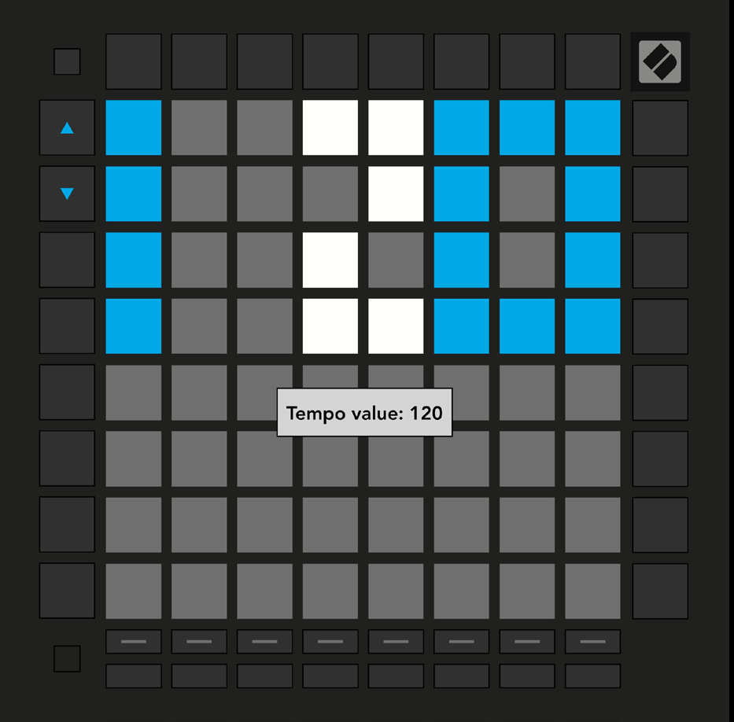
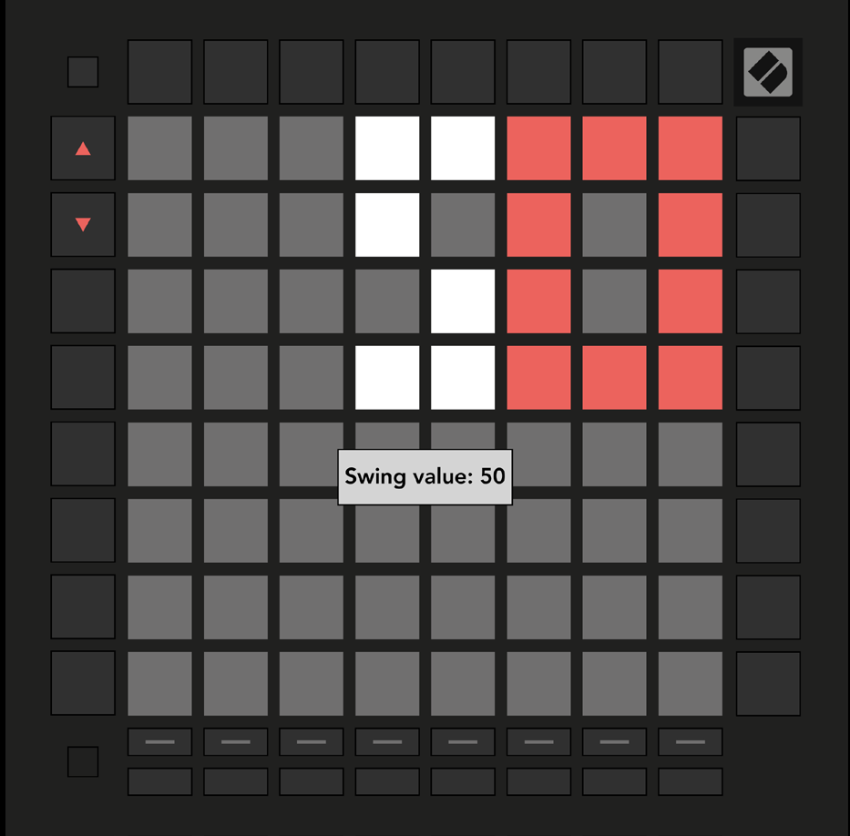

logseq-entity:: [[Logseq/Entity/Book/Section/Level 3]]
up:: [[Launchpad/UG/09 Sequencer/10 Tempo and Swing]]

- # 9.10.1 Editing Tempo and Swing
	- Hold Shift and press Device to open Tempo view (blue and white). The displayed number is the current BPM.
	- Hold Shift and press Stop Clip to open Swing view (orange and white). A value above 50 delays off-beat notes; a value below 50 moves them earlier.
	- Use the Up and Down arrows to adjust either value. Hold an arrow to cycle quickly.
	- Tempo view
		- 
	- Swing view
		- 