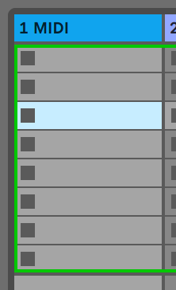
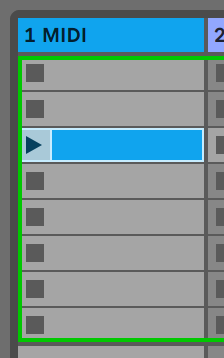
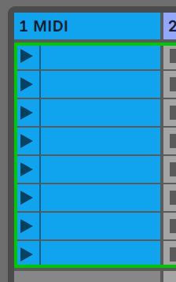

logseq-entity:: [[Logseq/Entity/Book/Section/Level 2]]
up:: [[Launchpad/UG/09 Sequencer]]
prev:: [[Launchpad/UG/09 Sequencer/10 Tempo and Swing]]
next:: [[Launchpad/UG/09 Sequencer/12 Projects]]

- # 9.11 Print to Clip
	- Print to Clip transfers the selected sequencer track’s current Pattern or Pattern chain directly into an Ableton Live clip slot.
	- Select a clip slot in Live, then press Print to Clip on Launchpad Pro. You can also select a slot from Launchpad Pro: open Session View, hold Shift, and press a grid pad.
	- Selected empty clip slot
		- 
	- If the selected slot is empty, the Pattern becomes a clip there. If it is occupied, Live uses the next empty slot below, letting you print several variations without overwriting clips.
	- Clip slot after Print to Clip
		- 
	- In Patterns View, hold Print to Clip and press a pulsing track-select button to print that track’s selected Pattern or chain.
	- > [[Note/Info]] Print to Clip works only while connected to Ableton Live. In Ableton Live Lite, the button goes dark when all eight clip slots in a track are full.
	- Full Ableton Live Lite track
		- 