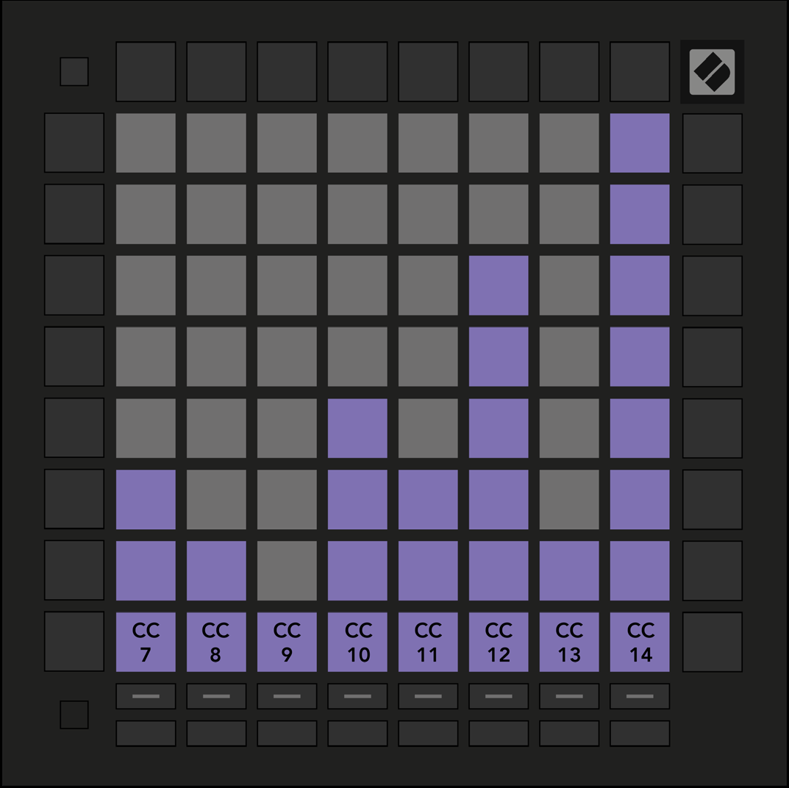

logseq-entity:: [[Logseq/Entity/Book/Section/Level 3]]
up:: [[Launchpad/UG/11 Appendix/01 Default MIDI Mappings]]
next:: [[Launchpad/UG/11 Appendix/01 Default MIDI Mappings/02 Custom 2]]

- # A.1.1 Custom 1
	- Eight vertical unipolar faders send CC 7–14.
	- A.1.1 — Custom 1 default mapping
		- 