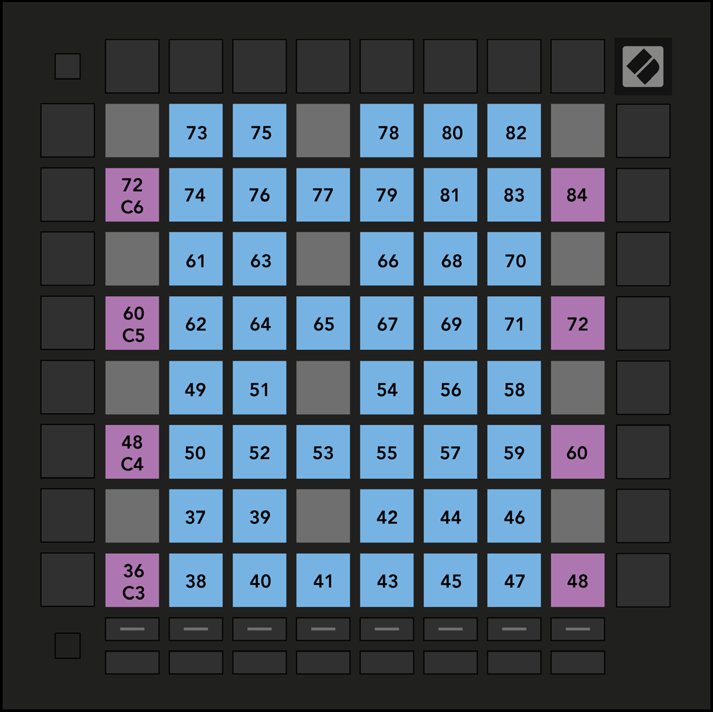

logseq-entity:: [[Logseq/Entity/Book/Section/Level 3]]
up:: [[Launchpad/UG/11 Appendix/01 Default MIDI Mappings]]
prev:: [[Launchpad/UG/11 Appendix/01 Default MIDI Mappings/03 Custom 3]]
next:: [[Launchpad/UG/11 Appendix/01 Default MIDI Mappings/05 Custom 5]]

- # A.1.4 Custom 4
	- The 8 × 8 grid sends momentary notes in a chromatic keyboard layout.
	- A.1.4 — Custom 4 default mapping
		- 