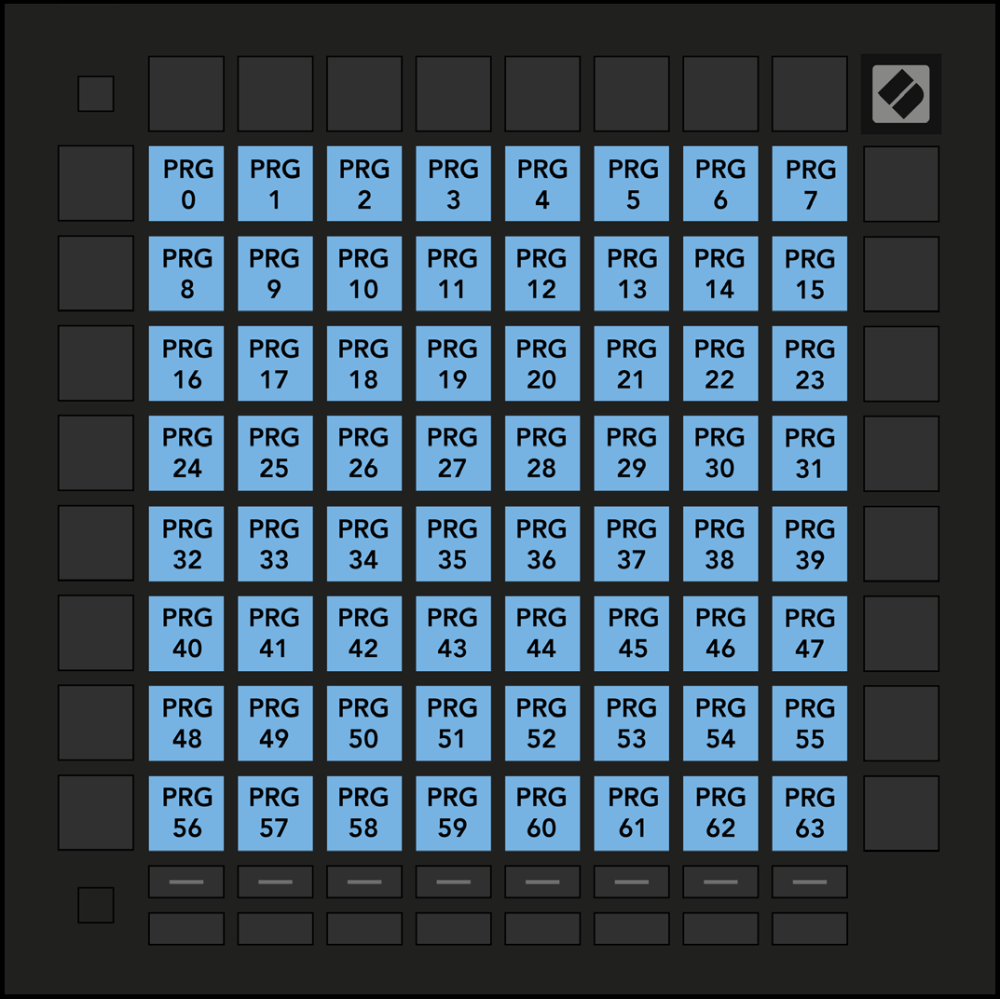

logseq-entity:: [[Logseq/Entity/Book/Section/Level 3]]
up:: [[Launchpad/UG/11 Appendix/01 Default MIDI Mappings]]
prev:: [[Launchpad/UG/11 Appendix/01 Default MIDI Mappings/04 Custom 4]]
next:: [[Launchpad/UG/11 Appendix/01 Default MIDI Mappings/06 Custom 6]]

- # A.1.5 Custom 5
	- The 8 × 8 grid sends Program Changes 0–63.
	- A.1.5 — Custom 5 default mapping
		- 