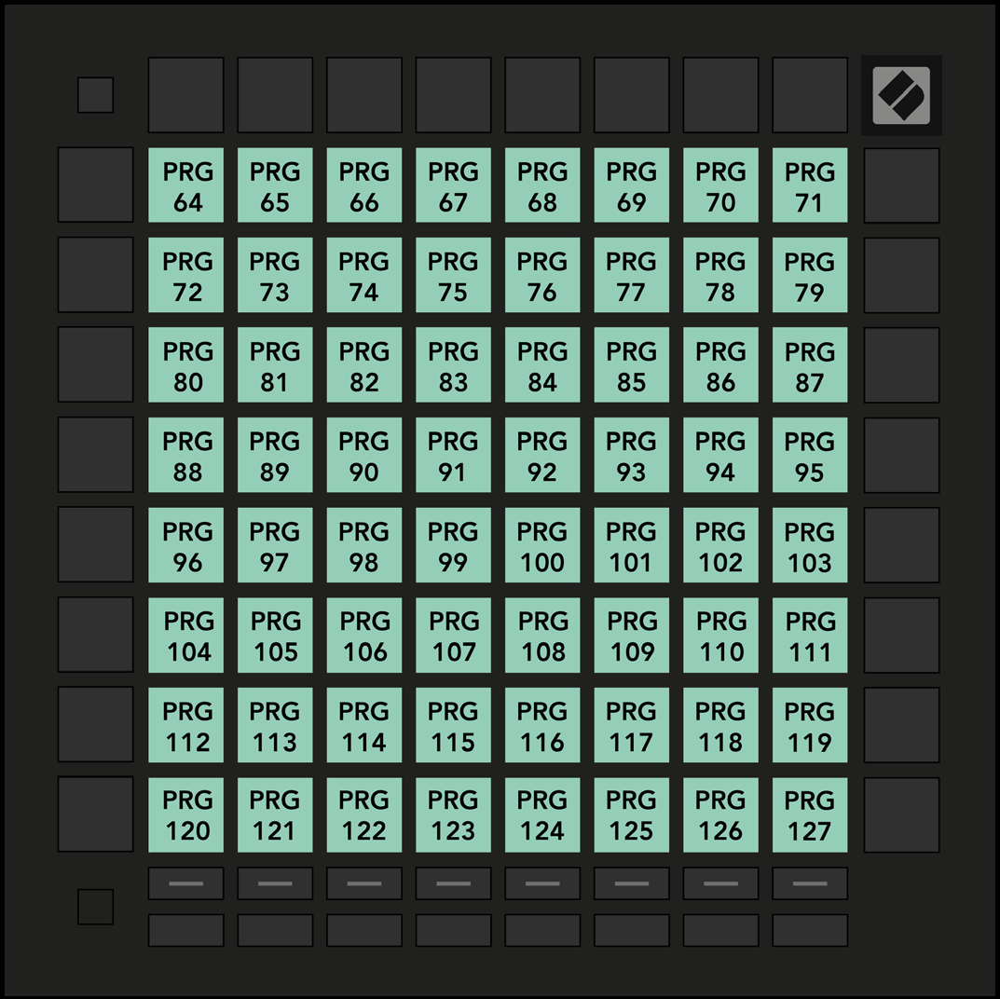

logseq-entity:: [[Logseq/Entity/Book/Section/Level 3]]
up:: [[Launchpad/UG/11 Appendix/01 Default MIDI Mappings]]
prev:: [[Launchpad/UG/11 Appendix/01 Default MIDI Mappings/05 Custom 5]]
next:: [[Launchpad/UG/11 Appendix/01 Default MIDI Mappings/07 Custom 7]]

- # A.1.6 Custom 6
	- The diagram assigns Program Changes 64–127 to the 8 × 8 grid.
	- > [[Note/Info]] The guide’s A.1.6 heading calls this “Momentary Note On,” while its diagram labels every pad PRG 64–127. [[Launchpad/UG/08 Custom Modes/02 Default Custom Modes]] also describes Custom 6 as Program Change 64–127.
	- A.1.6 — Custom 6 default mapping
		- 