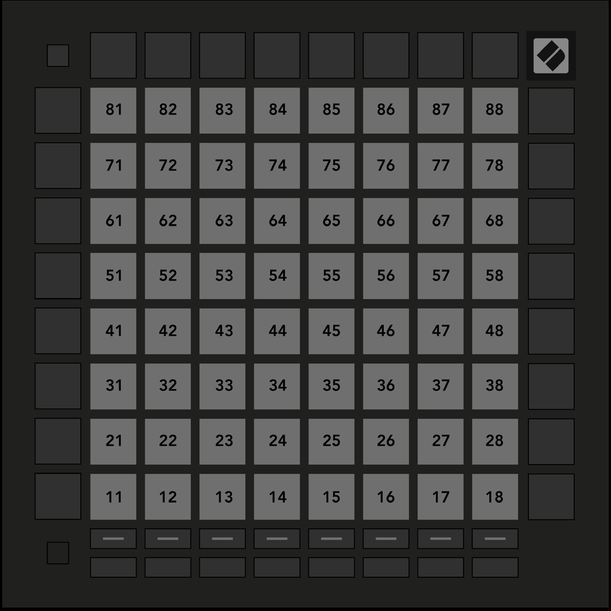

logseq-entity:: [[Logseq/Entity/Book/Section/Level 3]]
up:: [[Launchpad/UG/11 Appendix/01 Default MIDI Mappings]]
prev:: [[Launchpad/UG/11 Appendix/01 Default MIDI Mappings/07 Custom 7]]
next:: [[Launchpad/UG/11 Appendix/01 Default MIDI Mappings/09 Programmer Mode]]

- # A.1.8 Custom 8
	- The 8 × 8 grid sends momentary notes in the Programmer Mode-style map.
	- A.1.8 — Custom 8 default mapping
		- 