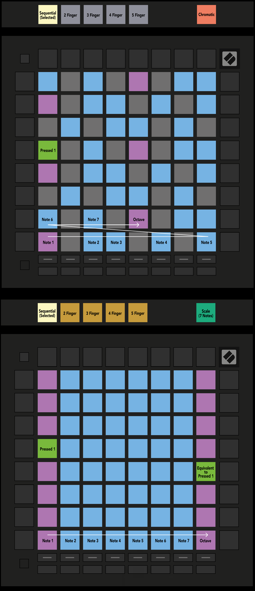

logseq-entity:: [[Logseq/Entity/Book/Section/Level 3]]
up:: [[Launchpad/UG/11 Appendix/02 Overlap Layouts]]
prev:: [[Launchpad/UG/11 Appendix/02 Overlap Layouts/02 Four Finger]]

- # A.2.3 Overlap – Sequential
	- Sequential overlap places notes linearly in Chromatic Mode and repeats only root octaves in Scale Mode.
	- A.2.3 — Sequential overlap in Chromatic and Scale Modes
		- 