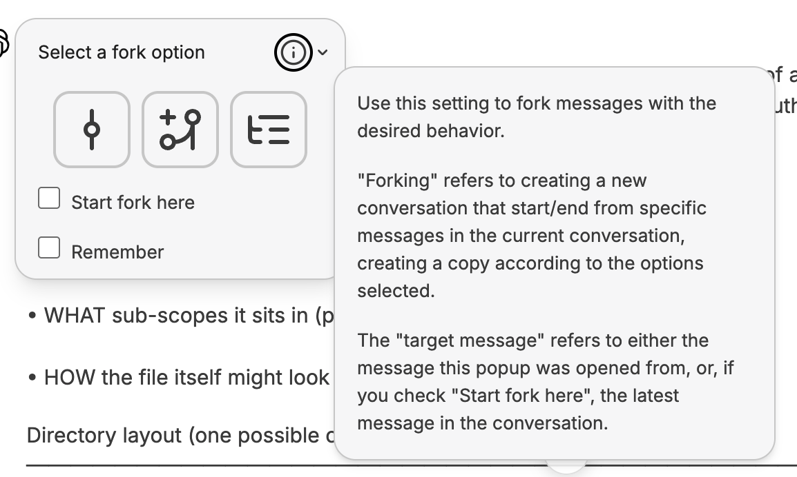

- [LibreChat's Forking Feature](https://www.librechat.ai/docs/features/fork)
	- 
	- ## [[My Notes]]
		- I'm confused by the different options for this feature.
	- ## [Forking Options](https://www.librechat.ai/docs/features/fork#forking-options)
		- Use these settings to fork messages with the desired behavior.
		- Forking refers to creating a new conversation that starts/ends from specific messages in the current conversation, creating a copy according to the options selected.
		- The “target message” refers to either the message the popup was opened from, or, if you check “Start fork here”, the latest message in the conversation.
		- ### [Visible messages only](https://www.librechat.ai/docs/features/fork#visible-messages-only)
			- This option forks only the visible messages; in other words, the direct path to the target message, without any branches.
				- 
		- ### [Include related branches](https://www.librechat.ai/docs/features/fork#include-related-branches)
			- This option forks the visible messages, along with related branches; in other words, the direct path to the target message, including branches along the path.
				- 
		- ### [Include all to/from here (default)](https://www.librechat.ai/docs/features/fork#include-all-tofrom-here-default)
			- This option forks all messages leading up to the target message, including its neighbors; in other words, all message branches, whether or not they are visible or along the same path, are included.
				- 
		- ## [Additional Options](https://www.librechat.ai/docs/features/fork#additional-options)
			- **Start fork here:** If checked, forking will commence from this message to the latest message in the conversation, according to the behavior selected above.
				- 
			- **Remember:** Check to remember the options you select for future usage, making it quicker to fork conversations as preferred.
				- 