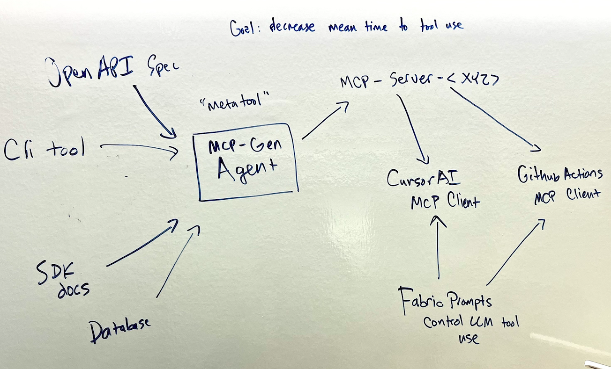

tags:: Idea, Whiteboard

- 
- Idea for a "Metatool" to generate [[Model Context Protocol]] servers, given specifications of existing tools, in order to be able to consume them in [[CursorAI]], [[GitHub/Actions]] or in [[CLI]] prompting