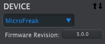
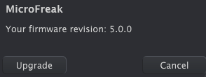

logseq-entity:: [[Logseq/Entity/Book/Section/Level 2]]
up:: [[Microfreak/02 Installation]]
prev:: [[Microfreak/02 Installation/06 Connecting to the World]]
- # 02.07 Get the Latest Firmware
	- The latest MicroFreak firmware adds features described in [[Microfreak/01 Welcome and Introduction/02 New in FW 5.0.0]]. Install the latest firmware to get the full MicroFreak experience.
	- ### Download the firmware
		- Open the [Arturia Downloads and Manuals page](https://www.arturia.com/support/downloads&manuals).
		- Find **MIDI Control Center** in the sidebar and install the latest macOS or Windows version.
		- Find **MicroFreak** in the same sidebar and download its latest firmware.
	- ### Install the firmware
		- Connect the MicroFreak over USB and power it on, then open MIDI Control Center.
		- Select **MicroFreak** from the **DEVICE** menu in the upper-left corner. The menu displays the current firmware revision:
			- 
		- Click **Firmware Revision** to open the dialog showing the current version:
			- 
		- Click **Upgrade**, then use the operating system file dialog to select the downloaded firmware file.
	- > [[Note/Warning]] While the firmware update is in progress, do not turn the MicroFreak's knobs, power it off, or disconnect its USB cable.
