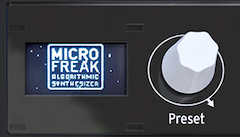

logseq-entity:: [[Logseq/Entity/Book/Section/Level 4]]
up:: [[Microfreak/03 Overview/01 Front Panel/01 Top Row]]
prev:: [[Microfreak/03 Overview/01 Front Panel/01 Top Row/03 Panel Select]]
next:: [[Microfreak/03 Overview/01 Front Panel/01 Top Row/05 Save]]
- # 03.01.01.04 The Display and the Preset encoder
	- The OLED display shows information about knobs and buttons. Turn the Preset encoder beside it to browse presets; the display shows each preset's name and category.
	- Firmware 5.0.0 increased capacity from 384 to 512 slots. A bank of 64 new presets can be loaded from the MIDI Control Center. Empty presets default to the name “Init” and category “Bass.”
	- > [[Note/Info]] Factory presets are protected against overwrite by default. Change this in `Utility > Misc > Mem Protect`.
	- The Preset manager
		- 
