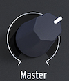

logseq-entity:: [[Logseq/Entity/Book/Section/Level 4]]
up:: [[Microfreak/03 Overview/01 Front Panel/01 Top Row]]
prev:: [[Microfreak/03 Overview/01 Front Panel/01 Top Row/06 Utility]]
- # 03.01.01.07 Master Volume
	- **Master Volume** sets the global output level for both the line and headphone outputs. To balance one preset against another, set `Utility > Preset > Preset volume`.
	- The Volume knob
		- 
