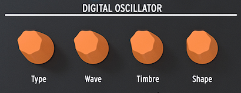

logseq-entity:: [[Logseq/Entity/Book/Section/Level 4]]
up:: [[Microfreak/03 Overview/01 Front Panel/02 Middle Row]]
prev:: [[Microfreak/03 Overview/01 Front Panel/02 Middle Row/01 Keyboard Glide]]
next:: [[Microfreak/03 Overview/01 Front Panel/02 Middle Row/03 Analog Filter]]
- # 03.01.02.02 Digital oscillator
	- The Digital Oscillator generates the MicroFreak's core sound. The Analog Filter, Envelopes, and LFO shape it. **Type**, **Wave**, **Timbre**, and **Shape** control its parameters; [[Microfreak/06 Dig Osc]] explains them in detail.
	- The Digital Oscillator
		- 
