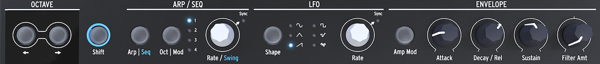

logseq-entity:: [[Logseq/Entity/Book/Section/Level 3]]
up:: [[Microfreak/03 Overview/01 Front Panel]]
prev:: [[Microfreak/03 Overview/01 Front Panel/02 Middle Row]]
- # 03.01.03 Bottom Row
	- Bottom row of the MicroFreak
		- 
	- {{embed [[Microfreak/03 Overview/01 Front Panel/03 Bottom Row/01 Octave Select]]}}
	- {{embed [[Microfreak/03 Overview/01 Front Panel/03 Bottom Row/02 Shift]]}}
	- {{embed [[Microfreak/03 Overview/01 Front Panel/03 Bottom Row/03 Arp Seq]]}}
	- {{embed [[Microfreak/03 Overview/01 Front Panel/03 Bottom Row/04 LFO]]}}
	- {{embed [[Microfreak/03 Overview/01 Front Panel/03 Bottom Row/05 Gen Env]]}}
	- {{embed [[Microfreak/03 Overview/01 Front Panel/03 Bottom Row/06 Keyboard]]}}
	- {{embed [[Microfreak/03 Overview/01 Front Panel/03 Bottom Row/07 Icon Strip]]}}
