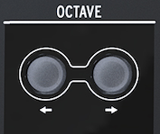

logseq-entity:: [[Logseq/Entity/Book/Section/Level 4]]
up:: [[Microfreak/03 Overview/01 Front Panel/03 Bottom Row]]
next:: [[Microfreak/03 Overview/01 Front Panel/03 Bottom Row/02 Shift]]
- # 03.01.03.01 Octave select
	- The octave buttons select the active keyboard range.
	- Octave select
		- 
