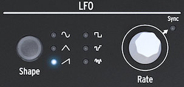

logseq-entity:: [[Logseq/Entity/Book/Section/Level 4]]
up:: [[Microfreak/03 Overview/01 Front Panel/03 Bottom Row]]
prev:: [[Microfreak/03 Overview/01 Front Panel/03 Bottom Row/03 Arp Seq]]
next:: [[Microfreak/03 Overview/01 Front Panel/03 Bottom Row/05 Gen Env]]
- # 03.01.03.04 LFO
	- The low-frequency oscillator produces modulation at 0.05–100 Hz and offers six waveforms.
	- The LFO
		- 
	- **Shape** selects a waveform
		- Sine rises and falls smoothly.
		- Triangle rises and falls linearly.
		- Rising sawtooth rises linearly and then drops suddenly.
		- Square switches suddenly between minimum and maximum.
		- Random stepped jumps between randomly generated values.
		- Random gliding moves gradually between randomly generated values.
	- **Rate** sets LFO speed. Press it to enable Sync, which follows the Sequencer/Arpeggiator tempo clock. With Sync off, Rate sets the speed independently.
