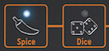

logseq-entity:: [[Logseq/Entity/Book/Section/Level 4]]
up:: [[Microfreak/03 Overview/01 Front Panel/03 Bottom Row]]
prev:: [[Microfreak/03 Overview/01 Front Panel/03 Bottom Row/06 Keyboard]]
- # 03.01.03.07 The Icon strip
	- The eight icons above the keyboard provide Arpeggiator, Pattern Generator, Sequencer, Spice, Dice, and Bend controls.
	- The icon strip
		- 
	- **Spice** and **Dice** vary the current arpeggio or sequence; their effects are audible only while the Arpeggiator or Sequencer runs. Dice changes gates and triggers, while Spice sets the amount of variation.
	- Spice & Dice
		- 
	- [[Microfreak/10 Keyboard]] explains the Icon strip in detail.
