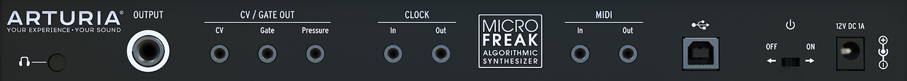

logseq-entity:: [[Logseq/Entity/Book/Section/Level 2]]
up:: [[Microfreak/03 Overview]]
prev:: [[Microfreak/03 Overview/01 Front Panel]]
next:: [[Microfreak/03 Overview/03 Signal Flow]]
- # 03.02 Rear Panel Overview
	- Rear Panel Overview
		- 
	- {{embed [[Microfreak/03 Overview/02 Rear Panel/01 Audio Outputs]]}}
	- {{embed [[Microfreak/03 Overview/02 Rear Panel/02 Pitch Gate Pressure]]}}
	- {{embed [[Microfreak/03 Overview/02 Rear Panel/03 Clock]]}}
	- {{embed [[Microfreak/03 Overview/02 Rear Panel/04 MIDI]]}}
	- {{embed [[Microfreak/03 Overview/02 Rear Panel/05 USB DC In]]}}
	- {{embed [[Microfreak/03 Overview/02 Rear Panel/06 Power Switch]]}}
	- {{embed [[Microfreak/03 Overview/02 Rear Panel/07 Power Connector]]}}
