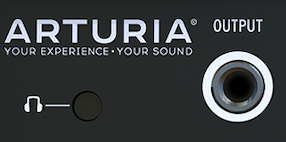

logseq-entity:: [[Logseq/Entity/Book/Section/Level 3]]
up:: [[Microfreak/03 Overview/02 Rear Panel]]
next:: [[Microfreak/03 Overview/02 Rear Panel/02 Pitch Gate Pressure]]
- # 03.02.01 Audio outputs
	- The headphone output is a 3.5 mm TS or TRS jack. The MicroFreak sends the same mono signal to both sides of stereo headphones.
	- Audio output
		- 
	- The headphone jack also accepts the microphone supplied with the MicroFreak Vocoder Edition. A TRRS device, such as a gaming headset with a built-in microphone, can serve as an audio input on a standard MicroFreak.
	- > [[Note/Warning]] Pull the microphone straight out of the headphone jack to avoid damage. Remove it before storing or transporting the MicroFreak.
	- The Line output is a balanced 6.35 mm TRS jack for an amplifier or mixer. A TRS cable improves the signal-to-noise ratio. Its signal is mono.
