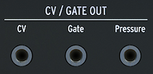

logseq-entity:: [[Logseq/Entity/Book/Section/Level 3]]
up:: [[Microfreak/03 Overview/02 Rear Panel]]
prev:: [[Microfreak/03 Overview/02 Rear Panel/01 Audio Outputs]]
next:: [[Microfreak/03 Overview/02 Rear Panel/03 Clock]]
- # 03.02.02 Pitch/Gate/Pressure outputs
	- These outputs send electrical signals to external analog synthesizers or a Eurorack modular system.
	- CV, Gate and Pressure outputs
		- 
	- CV sends a control voltage for an external oscillator; Gate triggers an external device.
	- Pressure sends a pressure or velocity voltage, selected in Utility > Preset > Press mode.
