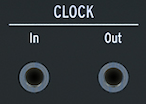

logseq-entity:: [[Logseq/Entity/Book/Section/Level 3]]
up:: [[Microfreak/03 Overview/02 Rear Panel]]
prev:: [[Microfreak/03 Overview/02 Rear Panel/02 Pitch Gate Pressure]]
next:: [[Microfreak/03 Overview/02 Rear Panel/04 MIDI]]
- # 03.02.03 Clock input/output
	- Sync the MicroFreak with external synthesizers or modular systems through the Clock input and output.
	- Clock input and output
		- 
	- > [[Note/Info]] A TRS jack carries both clock and start signals. A TS jack carries only clock.
