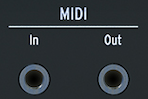

logseq-entity:: [[Logseq/Entity/Book/Section/Level 3]]
up:: [[Microfreak/03 Overview/02 Rear Panel]]
prev:: [[Microfreak/03 Overview/02 Rear Panel/03 Clock]]
next:: [[Microfreak/03 Overview/02 Rear Panel/05 USB DC In]]
- # 03.02.04 MIDI input/output
	- MIDI input and output
		- 
	- Use the included gray 3.5 mm TRS-to-5-pin-DIN adapters to send and receive MIDI and controller data from compatible devices.
