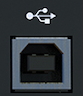

logseq-entity:: [[Logseq/Entity/Book/Section/Level 3]]
up:: [[Microfreak/03 Overview/02 Rear Panel]]
prev:: [[Microfreak/03 Overview/02 Rear Panel/04 MIDI]]
next:: [[Microfreak/03 Overview/02 Rear Panel/06 Power Switch]]
- # 03.02.05 USB/DC IN
	- The USB connector supplies power and exchanges data with a computer. A 5 V, 500 mA USB phone charger can also power the MicroFreak without a computer.
	- The USB connector
		- 
	- USB connects the MicroFreak to Arturia MIDI Control Center for settings, firmware updates, and preset management.
