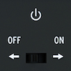

logseq-entity:: [[Logseq/Entity/Book/Section/Level 3]]
up:: [[Microfreak/03 Overview/02 Rear Panel]]
prev:: [[Microfreak/03 Overview/02 Rear Panel/05 USB DC In]]
next:: [[Microfreak/03 Overview/02 Rear Panel/07 Power Connector]]
- # 03.02.06 Power switch
	- The recessed switch turns the MicroFreak off without unplugging USB. When both USB and DC power are connected, DC power takes priority; connecting DC power resets the MicroFreak.
	- The On-Off switch
		- 
	- > [[Note/Info]] The MicroFreak can run from a phone or tablet power bank.
