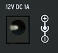

logseq-entity:: [[Logseq/Entity/Book/Section/Level 3]]
up:: [[Microfreak/03 Overview/02 Rear Panel]]
prev:: [[Microfreak/03 Overview/02 Rear Panel/06 Power Switch]]
- # 03.02.07 Power Connector
	- Connect the supplied Arturia power supply to the mains outlet. The supply provides the ground required by the capacitive keyboard.
	- The power connector
		- 
