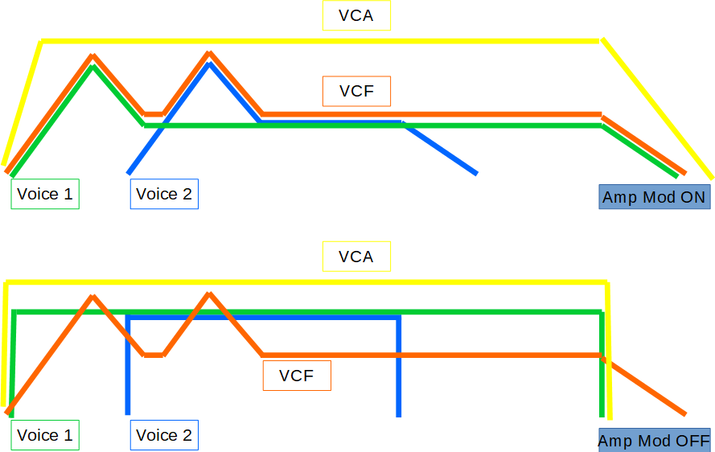

logseq-entity:: [[Logseq/Entity/Book/Section/Level 2]]
up:: [[Microfreak/03 Overview]]
prev:: [[Microfreak/03 Overview/02 Rear Panel]]
- # 03.03 Signal Flow
	- The Digital Oscillator sends its waveform to the Filter and an analog VCA. The main Envelope has a fixed connection to the VCA. With **Amp Mod** on, the main Envelope controls the VCA; with **Amp Mod** off, the keyboard Gate controls it.
	- The signal flow of the MicroFreak
		- 
	- In Paraphonic mode with **Amp Mod** on, copies of the envelope control internal digital VCAs, one for each voice set in Utility.
	- The main Envelope also controls Filter cutoff through the **Filter Amount** knob. Turning the knob lights the envelope-to-filter connection in the Matrix.
