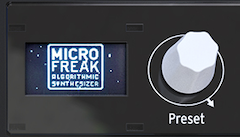

logseq-entity:: [[Logseq/Entity/Book/Section/Level 2]]
up:: [[Microfreak/04 Presets]]
next:: [[Microfreak/04 Presets/02 Save Presets]]
- # 04.01 Loading Presets
	- Turn the Preset encoder to load a preset. The first 128 slots contain factory presets. If you want to keep those intact while learning synthesis, use slots 129–512 for your sounds.
	- Presets in slots 129–512 are templates for building sounds in specific categories. A preset you like can also serve as a template for further exploration.
	- Tweak the loaded preset, then save it if you want to keep your changes.
	- > [[Note/Warning]] By default, loading another preset clears unsaved changes without warning. Turn on Utility > Global > Controls > Click to Load to browse without replacing the current sound; click the encoder to save the current changes and load the selected preset.
	- Press the Preset encoder quickly three times to reset the current sound to its initial empty state. This also clears an existing preset's sound.
	- > [[Note/Info]] The reset does not change the stored preset unless you save afterward.
	- The Preset encoder
		- 
