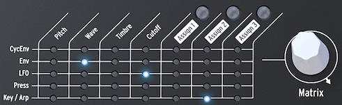

logseq-entity:: [[Logseq/Entity/Book/Section/Level 2]]
up:: [[Microfreak/05 Connections]]
prev:: [[Microfreak/05 Connections/01 Control Signals]]
next:: [[Microfreak/05 Connections/03 Freaky Ideas]]
- # 05.2 The Matrix and its encoder
	- The Matrix links control signals from sources to destinations.
	- A classic synthesizer sends an oscillator through a filter and then an amplifier. The Matrix lets you override those fixed connections and route triggers, gates, LFO waves, and envelopes to the Digital Oscillator and Filter.
	- The Matrix is the main switchboard for creating, changing, and mixing modulation connections. It has a switchboard and an encoder for selecting connections and setting their modulation amount.
	- The Matrix and its encoder
		- 
	- Turn the encoder to choose a source–destination point, then press it to create or edit the connection. It scrolls forward or backward and wraps at the end of the Matrix.
	- The Matrix shows each connection's state:
		- **LED off:** no connection is active, or its amount is zero.
		- **LED on:** a connection is active.
		- **LED blinking:** the connection is selected and its modulation amount is being edited.
	- The display shows the selected connection and its current modulation amount. Press the encoder to edit the amount; the display inverts and only that connection's LED stays lit. Changes take effect immediately.
	- Multiple sources can control the same destination. For example, Key/Arp and the LFO can both affect oscillator pitch, and their modulation amounts are added together. With a rectangular LFO wave, this can transpose a sequence up and down at the LFO rate.
	- Setting a connection's amount to zero turns it off. To clear a Matrix point and reset its amount, hold the encoder for at least 0.5 seconds.
	- To create and edit a connection:
		- Turn the encoder to select a point and press it.
		- Turn the encoder to set a positive or negative modulation amount.
	- To disable a connection and reset its amount:
		- Select the connection with the encoder.
		- Hold the encoder for at least 0.5 seconds, or set its amount to zero.
	- {{embed [[Microfreak/05 Connections/02 Matrix and Encoder/01 Sources and Destinations]]}}
	- {{embed [[Microfreak/05 Connections/02 Matrix and Encoder/02 Assigning Destinations]]}}
