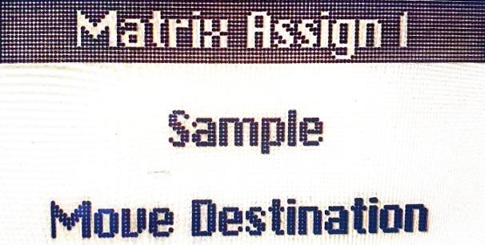

logseq-entity:: [[Logseq/Entity/Book/Section/Level 3]]
up:: [[Microfreak/05 Connections/02 Matrix and Encoder]]
prev:: [[Microfreak/05 Connections/02 Matrix and Encoder/01 Sources and Destinations]]
- # 05.2.2 Assigning destinations
	- Assign1, Assign2, and Assign3 are user-defined destinations. They can turn nearly any MicroFreak knob into a modulation destination.
	- Master Volume and the Preset Encoder cannot be assigned. Shift-plus-knob parameters, control buttons, and icon buttons such as Spice and Dice cannot be assigned either.
	- To assign a destination to one source:
		- Select its Assign point in the Matrix and press the encoder to enter edit mode.
		- Hold the corresponding Assign button and turn the knob to use as a destination. The display confirms the parameter.
		- Turn the encoder to set the modulation amount, then press it to leave edit mode.
	- To assign one destination to every source in a column, hold an Assign button and move the desired knob. Then set the amount for each source in that column.
	- Possible modulation destinations include:
		- **Glide:** Glide amount.
		- **Oscillator Type:** oscillator model.
		- **Sample:** sample slot index.
		- **Oscillator Wave, Timbre, and Shape:** the corresponding parameter of the selected oscillator.
		- **Filter Cutoff and Resonance:** cutoff frequency and filter bandwidth.
		- **Envelope Attack, Decay, Sustain, and Filter Amount:** the Standard Envelope stages and its amount sent to the amplifier.
		- **LFO Rate:** LFO speed.
		- **Arp&Seq Rate:** arpeggiator and sequencer rate.
		- **Cycling Envelope Rise, Fall, and Hold:** the Cycling Envelope's stages.
		- **Cycling Envelope Amount:** amount sent from CycEnv to the Matrix.
		- **Matrix Modulation Amount:** modulation amount of a Matrix point.
	- Starting with MicroFreak firmware 5.0.0, Sample can be assigned by opening the Sample select menu, pressing one of the three Assign buttons, and turning the Type knob.
	- Sample assigned as a Matrix destination
		- 
	- A Matrix connection's modulation amount can itself be modulated. To vary vibrato depth with the Cycling Envelope:
		- Route the LFO to oscillator Pitch.
		- Select CycEnv→Assign1 in the Matrix and hold Assign1.
		- Select the LFO→Pitch point and press the encoder to make it the modulation-amount destination.
		- Return to CycEnv→Assign1 and set its amount. The Cycling Envelope now changes the vibrato depth.
	- In Paraphonic mode, all voices are assigned simultaneously as a destination.
	- To clear all Matrix routings, hold Shift and press the Matrix encoder.
	- The Matrix routes sources to destinations and mixes multiple sources at one destination. The encoder sets modulation strength in either a positive or negative direction.
