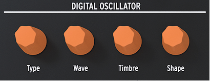

logseq-entity:: [[Logseq/Entity/Book/Section/Level 2]] 
up:: [[Microfreak/06 Dig Osc]]
next:: [[Microfreak/06 Dig Osc/02 Param Controls]]

- # 06.01 The oscillator as a sound generator
	- When you hear a sound, you hear air vibrating against the eardrum of your ear. As humans, we can hear frequencies in the range of 20 to 20,000 Hz. As you age your ability to hear high frequencies will gradually diminish. At 65 you'll probably hear only frequencies up to 6000 Hz. But that is enough to be able to enjoy timbral variations in music.
	- The ear can perceive sound around 50 Hz as bass (think huge organ pipes), but around 30 Hz it's difficult for the ear to hear a sound as a pitch; it's perceived as a low rumble. In electronic music, low-frequency sounds are often used as voltage or control signals to modulate another module. An LFO is an oscillator specifically designed to generate frequencies in this range. The LFO in the MicroFreak can generate signals in the range from 0.1Hz to 100Hz. Please refer to [[Microfreak/08 LFO]] for details.
	  id:: 6ab64ab1-b770-448a-9708-979398d28b7e
	- id:: 6ab64abf-49ab-46af-8598-5e409a38d568
	  > [[Note/Info]] Modulation is not limited to this range; some audio oscillator models in the MicroFreak use a second oscillator to modulate their own frequency.
	- The Digital Oscillator
	  id:: 6ab65191-5104-46a1-8f9a-0deb5920fed4
		- 
		  id:: 6ab64aec-3885-46ac-a3b4-a469d669b27e
	- The Digital Oscillator can play notes in the range from C-2 to G8. Although the MicroFreak keyboard spans only two octaves, you can shift the range it plays up and down.
	- **Freaky idea**: Applying a (very) small dose of randomness to the pitch of the digital oscillator will make someone who listens to your track sit up and pay attention.