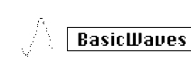

logseq-entity:: [[Logseq/Entity/Book/Section/Level 3]]
up:: [[Microfreak/06 Dig Osc/03 Types]]
- # 06.03.01 Basic Waves Oscillator (BasicWaves)
	- Classic Waveforms Oscillator Model
		- 
	- **Description:** Every sound consists of a series of harmonics. The first harmonic is the fundamental, which determines the pitch you hear. The second harmonic is twice as high in pitch, the third is three times as high, and so on. On a guitar, touching the exact middle of a string produces the second harmonic; dividing the string into three parts produces the third harmonic.
	- The second and higher harmonics determine a sound's timbre. The second, fourth, sixth, and eighth harmonics are even; the third, fifth, seventh, and ninth are odd. Odd harmonics can add a more dissonant timbre.
	- Triangle and square waves contain only odd harmonics; a sawtooth contains odd and even harmonics. A sawtooth can emulate bowed strings: the bow catches the string periodically, then slips to its next position, creating a sawtooth-like wave.
	- The four basic waveforms developed in the early days of synthesis are sine, triangle, square, and sawtooth. Each has a different mix of even and odd harmonics. The sine wave is the simplest, with only a fundamental. A square wave has only odd harmonics. To some ears, a square wave sounds more musical than a sawtooth, which contains all harmonics.
	- This oscillator emulates two basic waveforms: square and sawtooth.
	- **Morph:** Continuously morphs from a square wave to a sawtooth, then to two sawtooths. It changes waveform symmetry.
	- **Sym:** Morphs between square-wave pulse width and phasing between the two sawtooth copies. It has no effect when Wave is at 50 (sawtooth).
	- **Sub:** Adds a sine-wave sub-oscillator.
	- **Tip:** To get a sine wave, use the filter to remove all harmonics. Alternatively, set filter resonance to maximum; the filter then self-oscillates and produces a pure sine wave.
