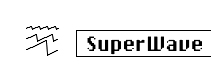

logseq-entity:: [[Logseq/Entity/Book/Section/Level 3]]
up:: [[Microfreak/06 Dig Osc/03 Types]]
prev:: [[Microfreak/06 Dig Osc/03 Types/01 BasicWaves]]
next:: [[Microfreak/06 Dig Osc/03 Types/03 Wavetable]]
- # 06.03.02 Superwave Oscillator (SuperWave)
	- The Superwave Oscillator Model
		- 
	- **Description:** This is a digital waveform animator that creates copies of a waveform and detunes them. Detuning them creates a very fat, lush sound. Unlike more traditional waveform animators that multiply a sawtooth wave, this model allows you to select from four different waveforms.
	- **Wave:** Selects the waveform to be multiplied: saw, square, triangle, or sinus.
	- **Detune:** Sets the detuning amount.
	- **Volume:** Sets the amplitude of the detuned waves.
