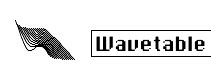

logseq-entity:: [[Logseq/Entity/Book/Section/Level 3]]
up:: [[Microfreak/06 Dig Osc/03 Types]]
prev:: [[Microfreak/06 Dig Osc/03 Types/02 SuperWave]]
next:: [[Microfreak/06 Dig Osc/03 Types/04 Harmo]]
- # 06.03.03 Wavetable oscillator (Wavetable)
	- The Wavetable Oscillator Model
		- 
	- **Description:** In the early '80s, advances in computer technology made it possible to scan through waveforms stored in memory. A waveform consists of short snippets called samples. 256 samples form a cycle of the wave. Each wavetable stores 32 cycles. Moving the Timbre knob moves through these cycles.
	- Once a waveform is stored in memory, its pitch can be changed by changing the speed at which it is read from memory. This is something an analog oscillator cannot do.
	- **Table:** The Wave knob selects one of the 16 waves stored in the table.
	- **Position:** Browses the 32 cycles.
	- **Chorus:** Activates a chorus effect on the wavetable.
	- **Tip:** Modulate the wave parameter with the LFO or Cycling Envelope to hear the oscillator's full sonic range. This technique is called wavesequencing.
