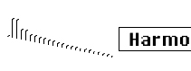

logseq-entity:: [[Logseq/Entity/Book/Section/Level 3]]
up:: [[Microfreak/06 Dig Osc/03 Types]]
prev:: [[Microfreak/06 Dig Osc/03 Types/03 Wavetable]]
- # 06.03.04 Harmonic OSC (Harmo)
	- Harmonic Oscillator Model
		- 
	- **Description:** Harmonic oscillators recreate sound by creating and summing harmonics. Varying the amplitude of individual harmonics changes the timbre. This oscillator sums complete waveforms, not just up to eight harmonics, producing more complex sounds than traditional harmonic oscillators.
	- **Content:** The Wave knob morphs through different tables of harmonic amplitudes and switches between them. Higher values provide tones with richer harmonic content.
	- **Sculpting:** The Timbre knob morphs between a sine and a triangle wave. A harmonic derived from a sine wave sounds different from one built from a triangle wave.
	- **Chorus:** Adds chorus to the oscillator sound, making it wider.
