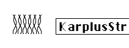

logseq-entity:: [[Logseq/Entity/Book/Section/Level 3]]
up:: [[Microfreak/06 Dig Osc/03 Types]]
prev:: [[Microfreak/06 Dig Osc/03 Types/04 Harmo]]
next:: [[Microfreak/06 Dig Osc/03 Types/06 VAnalog]]
- # 06.03.05 Karplus-Strong (KarplusStr)
	- Karplus Oscillator Model
		- 
	- **Description:** Karplus-Strong is a sound synthesis method developed by Kevin Karplus and Alex Strong at Stanford University. It creates realistic drum and plucked-string sounds by looping a short noise burst through a filtered delay. This physical modeling approach recreates an instrument's physical characteristics digitally, such as string bow position, striking force, and the materials' diffusion and damping.
	- In physical modeling, an exciter creates vibrations in a resonator. The exciter can be a bow or a strike, and the resonator can emulate many instrument shapes.
	- **Bow:** Sets how much bow is added on top of the strike. Bowing creates a continuous tone, while a strike alone creates a decaying tone.
	- **Position:** Controls where and how hard the resonator is struck. It does not affect the bowed part of the sound.
	- **Decay:** Sets the resonator's resonance by controlling its decay.
