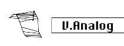

logseq-entity:: [[Logseq/Entity/Book/Section/Level 3]]
up:: [[Microfreak/06 Dig Osc/03 Types]]
prev:: [[Microfreak/06 Dig Osc/03 Types/05 KarplusStr]]
next:: [[Microfreak/06 Dig Osc/03 Types/07 Waveshaper]]
- # 06.03.06 Virtual Analog (V.Analog)
	- Virtual Analog Model
		- 
	- **Description:** Emulates the classic triangle, sawtooth, and square synthesis waveforms.
	- **Detune:** Sets the detuning between the two waves.
	- **Shape:** Morphs a variable square wave from a narrow pulse through a full square wave to hard-sync formants.
	- **Wave:** Morphs a variable saw wave from triangle to sawtooth with an increasingly wide notch.
	- **Tip:** Combine Detune with keyboard or arpeggio modulation for changing scale variations. On the Matrix, route Key/Arp to Wave.
