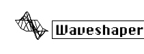

logseq-entity:: [[Logseq/Entity/Book/Section/Level 3]]
up:: [[Microfreak/06 Dig Osc/03 Types]]
prev:: [[Microfreak/06 Dig Osc/03 Types/06 VAnalog]]
next:: [[Microfreak/06 Dig Osc/03 Types/08 Two Op.FM]]
- # 06.03.07 Waveshaping Oscillator (Waveshaper)
	- Waveshaper Oscillator Model
		- 
	- **Description:** Combines a waveshaper and a wavefolder. The waveshaper changes a wave's rising and falling stages: it can steepen a triangle's rise into a falling saw, or change the curves of either stage. These changes affect the number and amplitude of harmonics, with more harmonics producing a richer, sometimes sharper, sound. The original model was based on a feature of the Serge waveshaper.
	- A wavefolder folds a wave back on itself. Unlike boosting a digital waveform until its top clips off, folding preserves the waveform by turning it back on itself.
	- **Wave:** Sets the waveshaper waveform.
	- **Amount:** Sets the wavefolder amount.
	- **Asym:** Sets waveform asymmetry.
