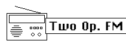

logseq-entity:: [[Logseq/Entity/Book/Section/Level 3]]
up:: [[Microfreak/06 Dig Osc/03 Types]]
prev:: [[Microfreak/06 Dig Osc/03 Types/07 Waveshaper]]
next:: [[Microfreak/06 Dig Osc/03 Types/09 Formant]]
- # 06.03.08 Two operator FM (Two Op.FM)
	- Two operator Oscillator Model
		- 
	- **Description:** FM synthesis began with Dr. John Chowning's work at Stanford University in the late 1960s. The first FM synthesizer ran on a mainframe computer—roughly a room full of refrigerators.
	- Chowning found that modulating a waveform with others tuned to the harmonic series could emulate many acoustic instruments. Inharmonic relationships produced bell-like tones and other intricate sounds that were difficult for analog synthesizers of the time to reproduce.
	- This oscillator uses two sine-wave oscillators, each modulating the phase of the other, to create a wide range of sounds.
	- **Ratio:** Sets the frequency ratio between the oscillators.
	- **Amount:** Sets the modulation index.
	- **Shape:** Sets feedback, with operator 2 modulating its own phase.
