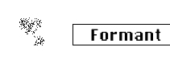

logseq-entity:: [[Logseq/Entity/Book/Section/Level 3]]
up:: [[Microfreak/06 Dig Osc/03 Types]]
prev:: [[Microfreak/06 Dig Osc/03 Types/08 Two Op.FM]]
next:: [[Microfreak/06 Dig Osc/03 Types/10 Chords]]
- # 06.03.09 Granular formant oscillator (Formant)
	- Granular formant Oscillator Model
		- 
	- **Description:** Granular synthesis chops a wave into tiny pieces called particles, then rearranges, multiplies, and combines them. This model rearranges particles into formants and filtered waveforms.
	- **Interval:** Sets the frequency ratio between formants one and two.
	- **Formant:** Sets the formant frequency.
	- **Shape:** Sets formant width and shape by controlling the window applied to the sum of two synchronized sine oscillators.
