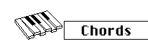

logseq-entity:: [[Logseq/Entity/Book/Section/Level 3]]
up:: [[Microfreak/06 Dig Osc/03 Types]]
prev:: [[Microfreak/06 Dig Osc/03 Types/09 Formant]]
next:: [[Microfreak/06 Dig Osc/03 Types/11 Speech]]
- # 06.03.10 Chords (Chords)
	- Chords Oscillator Model
		- 
	- **Description:** Chords mode turns the digital oscillator into four voices that can play and modulate chords.
	- The first note of a chord is its root. The third determines whether the chord is minor, three half-steps above the root, or major, four half-steps above it. Adding voices further shapes the minor or major feel.
	- A major chord may sound forceful and happy, while a minor chord may sound sad to listeners raised with Western music. Responses to major and minor scales differ across cultures.
	- > [[Note/Info]] For more on music theory, search the web or YouTube.
	- > [[Note/Info]] Paraphony is disabled in Chords mode. The last key pressed becomes the root note, and only one chord can play at a time.
	- **Type:** Selects the chord:
		- Octave
		- 5th
		- sus4
		- Minor
		- Minor 7
		- Minor 9
		- Minor 11
		- 6th and 9th added
		- Major 9
		- Major 7
		- Major
	- **Inv/Transp:** Changes the chord inversion and frequency range. The chord stays the same, but the pitches are combined differently as the Timbre knob moves or is modulated externally.
	- **Example:** Hold a C major chord (C/E/G) and turn Timbre to the right. At position 10, the chord reaches its first inversion; turning further produces other inversions.
