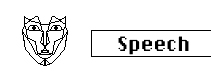

logseq-entity:: [[Logseq/Entity/Book/Section/Level 3]]
up:: [[Microfreak/06 Dig Osc/03 Types]]
prev:: [[Microfreak/06 Dig Osc/03 Types/10 Chords]]
next:: [[Microfreak/06 Dig Osc/03 Types/12 Modal]]
- # 06.03.11 Vowel and speech synthesis (Speech)
	- Vowel and speech synthesis Oscillator Model
		- 
	- **Description:** The Speech oscillator draws on speech synthesis research begun by Texas Instruments in the late 1970s, which led to the Speak & Spell talking toy. Vowels use unrestricted airflow while the throat and tongue shape their sound; consonants delimit and shape vowels.
	- **Type:** The Wave knob scans formants from 0 to about 100, then libraries of colors, numbers, letters, and words.
	- **Timbre:** Shifts the speech formants up or down.
	- **Word:** The Shape knob scans subsets of words from the library selected with the Wave knob.
	- ## Examples
		- Set Wave to its maximum, Timbre to 40, and Shape to 30. Play middle C to hear “Filter.” Enable paraphony to play the word with four voices.
		- Set Wave to 60, Timbre to 46, and Shape to 17. Play middle C to hear “One.”
	- ## Singing count
		- Activate Arpeggio mode with Arp|Seq.
		- Assign the oscillator Shape parameter to the LFO by pressing Assign 1 and turning Shape.
		- Set the modulation amount to about 80.
		- Select the triangle wave on the LFO and set its speed to about 80 Hz.
